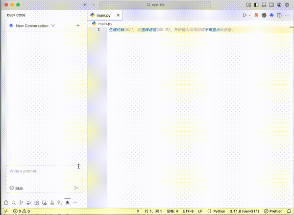

# Deep Code

Deep Code is an AI coding assistant extension for Visual Studio Code, specifically optimized for the latest `deepseek` model.

## Configuration

Create `~/.deepcode/settings.json` with:

```json
{
  "env": {
    "MODEL": "deepseek-chat",
    "BASE_URL": "https://api.deepseek.com",
    "API_KEY": "sk-..."
  }
}
```

## Key Features

### **Skills**
Deep Code supports agent skills that allows you to extend the assistant's capabilities:

- **Skill Discovery**: skills from `~/.deepcode/skills/` and `~/.claude/skills/` can be discovered and activated.

### **Optimized for DeepSeek**
- Specifically tuned for DeepSeek model performance.
- Reduce costs by using [Context Caching](https://api-docs.deepseek.com/guides/kv_cache).

## Supported Models
- `deepseek-chat` (recommended)
- Any other OpenAI-compatible model

## FAQ: How can I move Deep Code from the left sidebar to the right (Secondary Side Bar) in VS Code?



## Getting Help
- Report bugs or request features on GitHub Issues (https://github.com/lessweb/deepcode/issues).
