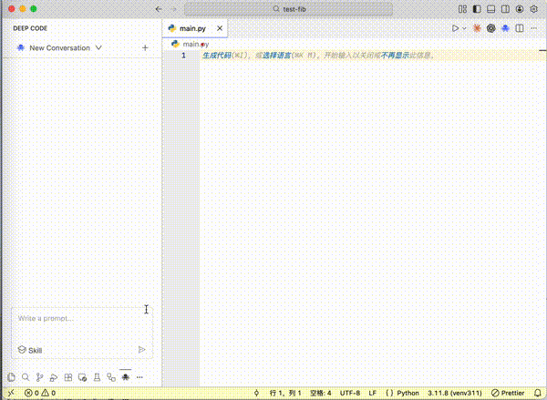

# Deep Code

[Deep Code](https://marketplace.visualstudio.com/items?itemName=vegamo.deepcoding) 是 Visual Studio Code 的 AI 编码助手扩展，专门为最新的 `deepseek` 模型优化。

## 配置

创建 `~/.deepcode/settings.json` 文件，内容如下：

```json
{
  "env": {
    "MODEL": "deepseek-reasoner",
    "BASE_URL": "https://api.deepseek.com",
    "API_KEY": "sk-...",
    "THINKING_ENABLED": true
  }
}
```

## 主要功能

### **Skills**
Deep Code 支持 agent skills，允许您扩展助手的能力：

- **Skill Discovery**：可以从 `~/.agents/skills/` 目录中发现并激活 skills。

### **为 DeepSeek 优化**
- 专门为 DeepSeek 模型性能调优。
- 通过使用[上下文缓存](https://api-docs.deepseek.com/guides/kv_cache)来降低成本。

## 支持的模型
- `deepseek-reasoner`（[思考模式](https://api-docs.deepseek.com/guides/kv_cache)，推荐使用）
- `deepseek-chat`
- 任何其他 OpenAI 兼容模型

## 截图示例


## 常见问题：如何将 Deep Code 从左侧边栏移动到右侧边栏（Secondary Side Bar）？



## 获取帮助
- 在 GitHub Issues 上报告错误或请求功能 (https://github.com/lessweb/deepcode/issues)。

## 支持我们

如果你觉得这个插件对你有帮助，请考虑通过以下方式支持我们：

- 在 GitHub 上给我们一个 Star (https://github.com/lessweb/deepcode)
- 向我们提交反馈和建议
- 分享给你的朋友和同事
